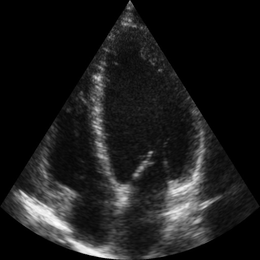

# Echo Left Segmentation:
This repository serves as a template for building a real-time Segmentation API using U2-Net and FastAPI. The project also includes Docker, a platform for easily building, shipping, and running distributed applications.


# What's inside:

- U2Net: Convolution NN model for Segmentation
- FastAPI 
- Docker 
- Pytest 

TODO:
- MLFLOW
- AIRFLOW
- DVC

### Sample
Here's a sample of what you can expect to see with this project:


---
# Getting Started

You have two options to start the application: using Docker or locally on your machine.

## Using Docker
Start the application with the following command:
```
docker-compose up
```
or 
```
docker compose up --build
```
*Note: You can change the address and port in the file **docker-compose.yaml***

## FAST API Docs url:
http://0.0.0.0:8001/docs#/

---
# Code Examples
### Example 1: Segmentation to JSON   
The following code demonstrates how to perform object detection and receive the results in JSON format:
```python
import requests

input_image_name = 'test_image.jpg'
api_host = 'http://0.0.0.0:8001/'
type_rq = ''

files = {'file': open(input_image_name, 'rb')}

response = requests.post(api_host+type_rq, files=files)

data = response.json()     
print(data)
```
Output:
```
(list[dict]): [{'class': class_id, class_name: "LV", coords: [[x1, y1], xn, yn]}, 
                                {'class': class_id, class_name: "LA", coords: [[...]]}]
```

### Example 2: Segmentation to Image    
The following code demonstrates how to perform object detection and receive the results in image format.
```python
import requests
from PIL import Image
from io import BytesIO
import matplotlib.pyplot as plt

input_image_name = 'test_image.jpg'
api_host = 'http://0.0.0.0:8001/'
type_rq = 'img_object_detection_to_img'

files = {'file': open(input_image_name, 'rb')}

response = requests.post(api_host+type_rq, files=files)

img = Image.open(BytesIO(response.content)) 
plt.imshow(img)
```

---

# Overview of the code
* [main.py](./main.py) - Base FastAPI functions  
* [app.py](./app.py) - Segmentation model functions     
* [./models](./models) - Segmentation models folder    

---
# Test
This repository contains functional tests for a program to ensure the proper operation of the service.

## Getting Started Test
To get started with the testing process, you first need to set up the necessary environment. This can be achieved by either installing the required packages or by running the Docker container.

#### Installing Required Packages:
Run the following command to install the necessary packages:
```
pip install -r requirements.txt
```

Alternatively, you can also run the tests inside a Docker container. To do so, follow these steps:
Start the Docker container:
```
docker-compose up
```
Connect inside the container:
```
docker exec -it {CONTAINER_ID} sh
```
Run the tests from the program directory:
```
pytest -v --disable-warnings
```


## Locally
To start the application locally, follow these steps:

1. Install the required packages:

```
pip install -r requirements.txt
```
2. Start the application:
```
uvicorn main:app --reload --host 0.0.0.0 --port 8001
```  